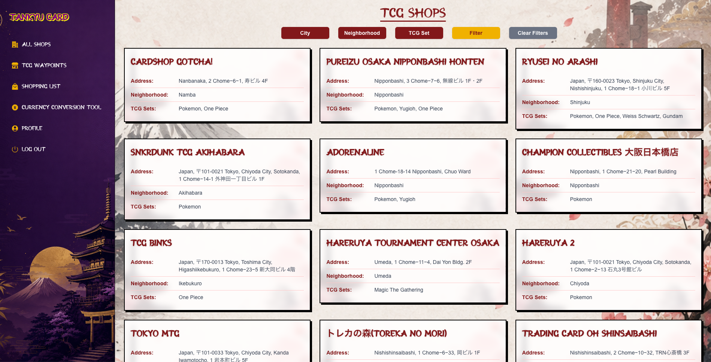
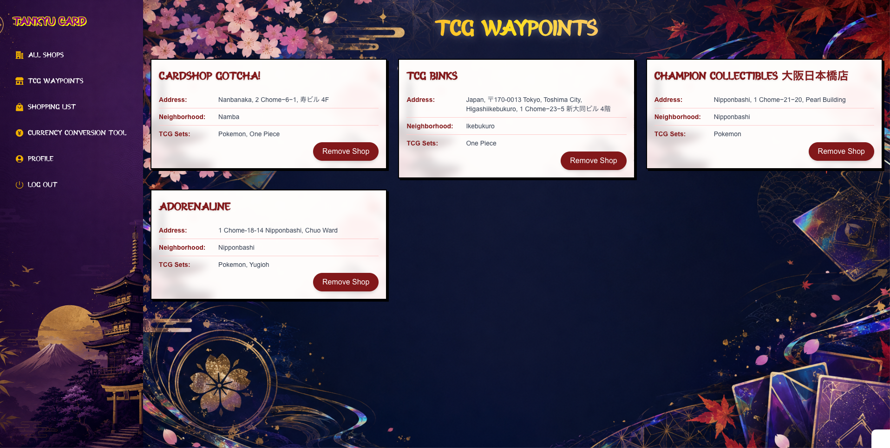
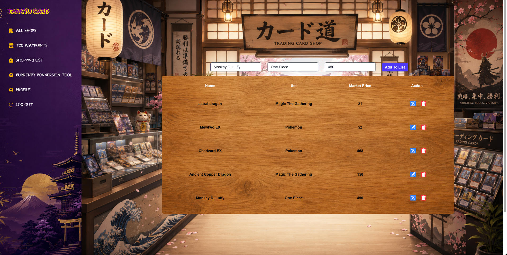
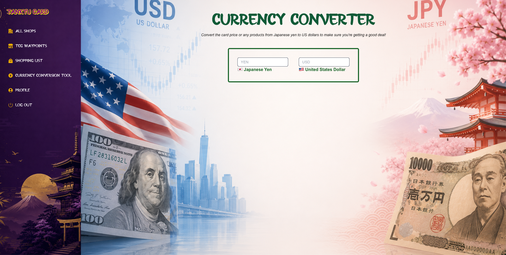

# Tankyu Card カード クエスト

A full-stack web app for trading card hobbyists. Trading card enthusiasts can maintain a card shop itinerary and a shopping list of cards that they are looking to purchase on their trip to Japan.

## Live Demo

https://tankyu-card.vercel.app/

## Screenshots

### Home Page

### Shop Itinerary

### Shopping List

### Currency Converter

## Features

- Browse and save trading card shops across various cities in Japan.
- View all saved trading card shops in your itinerary.
- Filter shops by city, neighborhood, and trading card set.
- Add cards to a shopping list by card name, set, and market price.
- Edit or remove cards from the shopping list.
- Convert prices between Japanese Yen and US Dollars.

## Technologies

### Languages

- JavaScript

### Frontend

- Next.js
- React
- Tailwind CSS
- Axios
- Yup

### Backend

- Node.js
- Express
- Passport
- JWT

### Database

- PostgreSQL
- NeonDB

### Tools & Deployment

- Git
- GitHub
- Vercel
- Render
